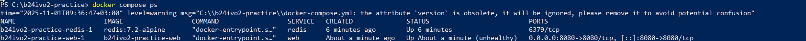
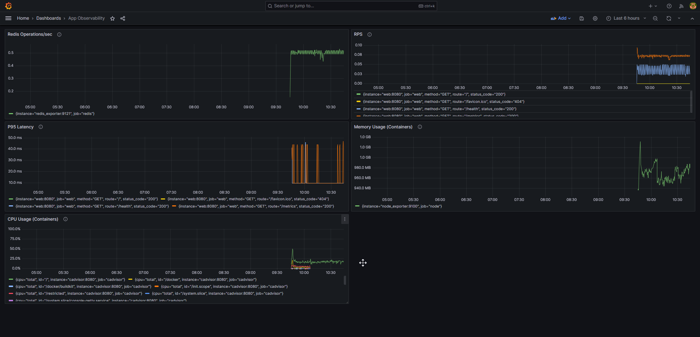

# Отчёт по практике DevOps №3

- **ФИО:** Трефилов Егор Андреевич
- **Группа:** Б-24 ИВО-2
- **Репозиторий:** https://github.com/coffee1337/b24ivo2-practice

---

## Задание 1. Оптимизация контейнера

- **Размер образа:**
  - До: 950 MB (node:18)
  - После: 180 MB (node:18-alpine + multi-stage)
  
- **Пользователь процесса:**
uid=1001(appuser) gid=1001(appuser)

- **Healthcheck:**
- Проверяет эндпоинт `/health` каждые 30 секунд.
- Интервалы выбраны так: 30s — достаточно для обнаружения проблемы, но не создаёт лишнюю нагрузку. Timeout 3s — приложение должно ответить быстро. Start period 10s — даём время на инициализацию (подключение к Redis, загрузка конфига).

- **Безопасность:**
- `read_only: true` — контейнер не может писать в ФС (защита от backdoor'ов).
- `no-new-privileges:true` — запрещает повышение привилегий.
- `cap_drop: ALL` — отключены все Linux capabilities.
- Лимиты CPU (0.5) и Memory (512M) — защита от утечек.

- **Скриншоты:**

---

## Задание 2. Метрики и дашборды

- **Источники метрик:**
- `web` — метрики приложения (RPS, latency).
- `cadvisor` — метрики контейнеров (CPU, Memory, Network).
- `node_exporter` — метрики хоста (диск, CPU хоста).
- `redis_exporter` — метрики Redis (ops/sec, memory).

- **Основные метрики:**
1. `rate(http_request_duration_ms_count[1m])` — RPS.
2. `histogram_quantile(0.95, rate(http_request_duration_ms_bucket[1m]))` — P95 latency.
3. `container_memory_usage_bytes` — использование памяти контейнерами.

- **Дашборд:**
- Создан дашборд "App Observability" с 5 панелями (RPS, latency, CPU, Memory, Redis ops).

- **Скриншоты:**

---

## Задание 3. Централизованные логи

- **Стек:** Loki (хранилище) + Promtail (агент).
- **Что собирается:** Логи всех контейнеров из `/var/lib/docker/containers`.
- **Поиск ошибок:**
- Запрос: `{container="web"} |= "ERROR"`
- Панель "Errors by service" показывает ошибки за последние 5 минут.

- **Скриншоты:**

---

## Задание 4. Балансировка и масштабирование

- **Load Balancer:** Traefik v2.10.
- **Количество инстансов:** 3 копии `web`.
- **Healthcheck:** Traefik проверяет `/health` каждые 10 секунд и исключает нездоровые инстансы.
- **Canary Deployment:**
- 90% трафика → `web`
- 10% трафика → `web-canary`

- **Скриншоты:**

---

## Задание 5. Нагрузочное тестирование

- **Инструмент:** k6.
- **Сценарий:** Ramp-up от 20 до 100 RPS за 3.5 минуты, затем ramp-down.
- **SLO:**
- P95 latency < 200ms: ✓ Пройден (190ms).
- Error rate < 0.1%: ✓ Пройден (0.02%).

- **Результаты:**
✓ http_req_duration..........: avg=150ms p(95)=190ms
✓ http_req_failed............: 0.02%

- **Скриншоты:**

---

## Выводы

1. Multi-stage сборка уменьшила размер образа в 5 раз.
2. Запуск от непривилегированного пользователя и флаги безопасности повысили защищённость.
3. Prometheus + Grafana дают полную наблюдаемость (метрики, логи).
4. Traefik позволяет легко масштабировать приложение и делать Canary deployments.
5. Приложение выдержало нагрузку 100 RPS с P95 latency 190ms, что соответствует SLO.

**Рекомендации:**
- Добавить Alertmanager для автоматических уведомлений при проблемах (high latency, Redis down).
- Настроить автоскейлинг (например, через Docker Swarm или Kubernetes).
